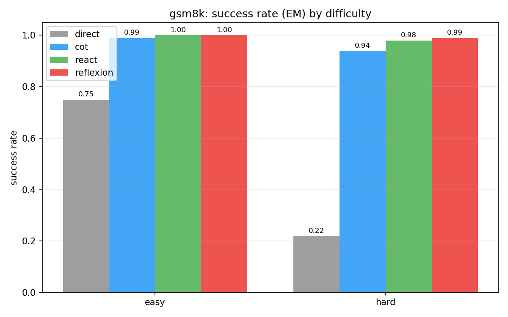
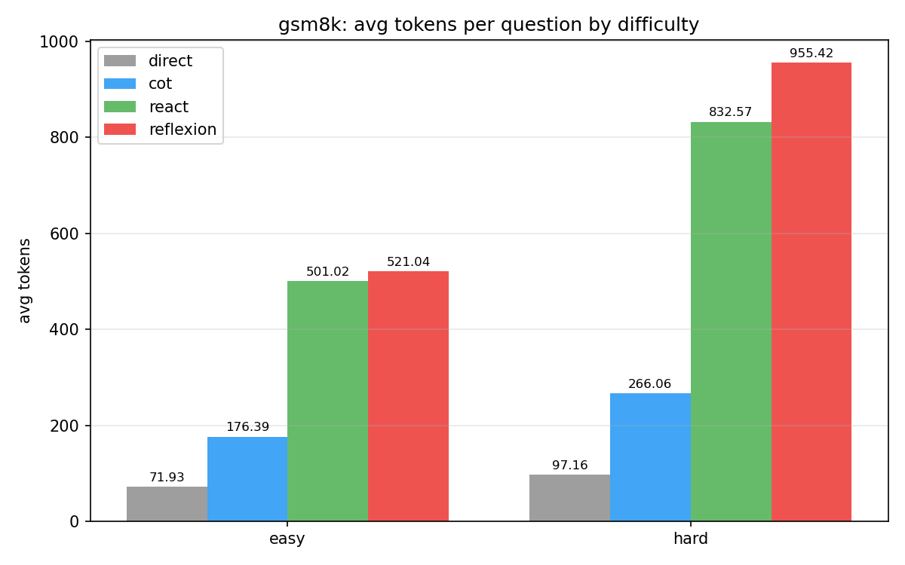
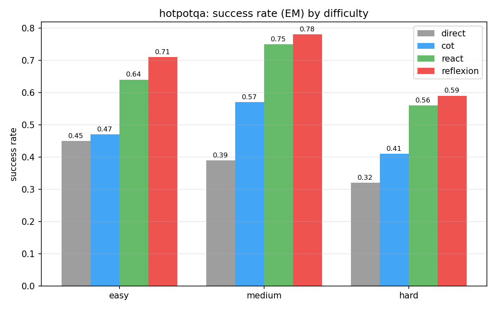
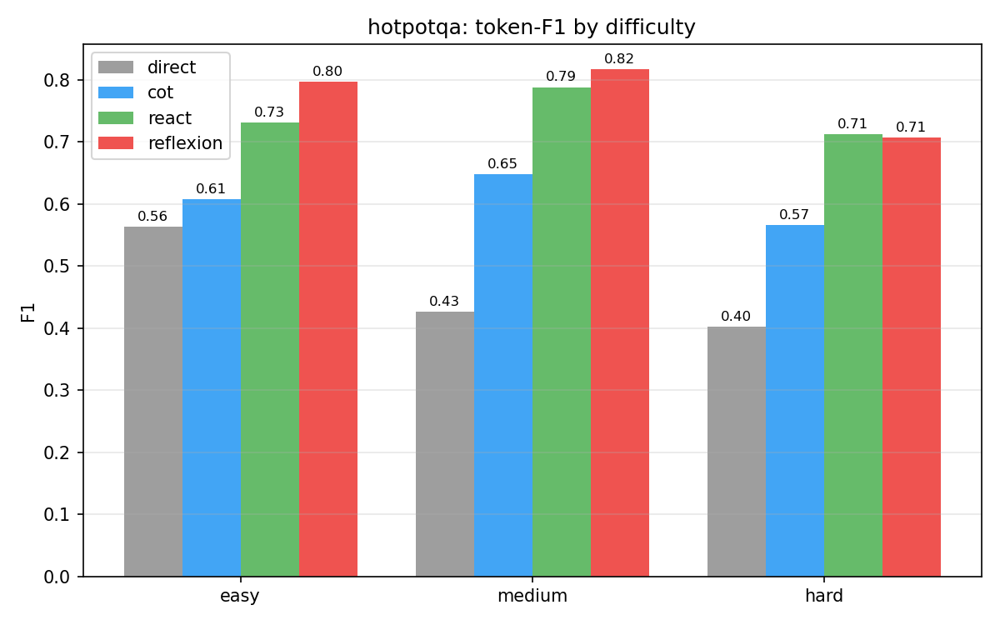
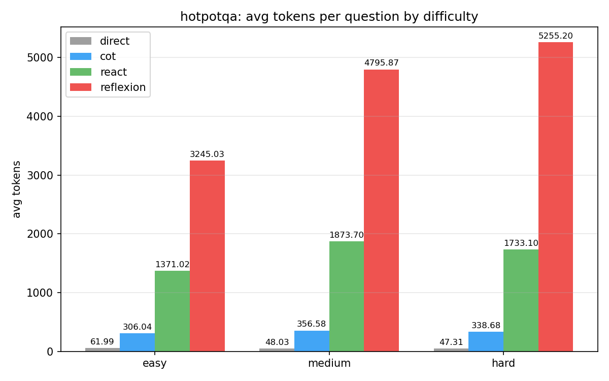

# 智能体控制流评测框架

> 探索"外部认知架构"如何激发大语言模型在复杂任务上的能力：用同一个模型、同一套工具接口，手写实现四种由弱到强的智能体控制流（Direct → CoT → ReAct → Reflexion），在不同难度的测试集上对比它们的任务成功率、交互轮数与 token 开销。

模型 API 使用 **DeepSeek**。四种控制流共用同一个模型客户端和同一套工具接口，**唯一的变量就是控制流本身**，以此保证对比公平。

---

## 一、四种控制流

| 控制流 | 是否推理 | 是否用工具 | 说明 |
|--------|:--------:|:----------:|------|
| **Direct** | ✗ | ✗ | 直接把问题丢给模型要答案。性能下限参照。 |
| **CoT** | ✓ | ✗ | 要求模型"一步步思考"再作答，但不调用工具。用来干净地剥离出"推理"本身的贡献。 |
| **ReAct** | ✓ | ✓ | 核心循环 Thought → Action → Observation，模型每轮决定调用哪个工具、看到结果再继续，直到输出 `Finish[答案]`（设最大轮数防死循环）。 |
| **Reflexion** | ✓ | ✓ | 在 ReAct 之上加一层"自我反思记忆"：一次尝试失败后，让模型用语言总结失败原因写入记忆，带着反思重试（最多 3 次）。 |

递进主线：**基线（Direct）→ 加推理（CoT）→ 加工具（ReAct）→ 加反思（Reflexion）**，逐层量化每种外部认知脚手架带来的增益和代价。

## 二、测试环境

- **GSM8K（数学推理 + 计算器工具）**：小学数学应用题。工具是一个安全的 `calculator`。按标准解法中的推理步数把题目分成 **easy / hard** 两档。
- **HotpotQA（多跳问答 + 检索工具）**：需要跨多个维基段落推理才能答对。采用 **distractor 设置**——每道题自带 10 个维基段落，工具 `search[实体]` / `lookup[关键词]` 在这些段落上检索，无需联网、完全可复现。难度用数据集原生的 **easy / medium / hard** 标签。
  - 注：HotpotQA 的 dev/test 集全部标注为 hard，难度标签只存在于 train 集；由于本项目只做**评测**、不训练模型，因此从 train 集中抽取带难度标签的题目作为评测池，不存在数据泄漏。
  - Direct / CoT 不带工具，相当于**闭卷**（仅靠模型自身知识）；ReAct / Reflexion 能检索段落，相当于**开卷**。两者对比正好体现"检索工具"的价值。

## 三、评测指标

- **成功率（success rate）**：
  - GSM8K：抽取最终数字，与标准答案数值比对（即 Exact Match）。
  - HotpotQA：**EM（Exact Match，精确匹配）**——模型答案经归一化（转小写、去标点、去掉 a/an/the 等冠词）后与标准答案**完全一致**才算对，结果是 0 或 1，非常严格。
- **F1（仅 HotpotQA）**：**词级别的 F1 分数**。把模型答案和标准答案都拆成词，计算两者的词重合度（precision 与 recall 的调和平均），**部分答对也能得分**。
  - 举例：标准答案是 `President Richard Nixon`，模型答 `Richard Nixon`——EM = 0（不完全一致），但 F1 ≈ 0.8（绝大多数词对上了）。所以**对自由文本问答，F1 比 EM 更能反映"答得基本对"**，两者结合看最公允。
- **平均交互轮数（avg rounds）**：每题平均的推理 / 工具调用步数。
- **平均 token 消耗（avg tokens）**：每题平均消耗的 token，衡量"性能换代价"。
- **Reflexion 专项**：成功率随试验次数（trial）的提升曲线。

---

## 四、实验结果

> 每档各 100 题，模型 `deepseek-chat`，`temperature=0`。

### GSM8K（数学推理）

| 难度 | 指标 | Direct | CoT | ReAct | Reflexion |
|------|------|:------:|:---:|:-----:|:---------:|
| easy | 成功率 | 0.75 | 0.99 | **1.00** | **1.00** |
| easy | 平均轮数 | 1.0 | 1.0 | 2.09 | 2.13 |
| easy | 平均 token | 72 | 176 | 501 | 521 |
| hard | 成功率 | 0.22 | 0.94 | 0.98 | **0.99** |
| hard | 平均轮数 | 1.0 | 1.0 | 2.37 | 2.42 |
| hard | 平均 token | 97 | 266 | 833 | 955 |

Reflexion 成功率 vs 试验次数（hard）：trial1 = 98% → trial2 = 99% → trial3 = 99%





### HotpotQA（多跳问答）

| 难度 | 指标 | Direct | CoT | ReAct | Reflexion |
|--------|------|:------:|:---:|:-----:|:---------:|
| easy | 成功率(EM) | 0.45 | 0.47 | 0.64 | **0.71** |
| easy | F1 | 0.56 | 0.61 | 0.73 | **0.80** |
| easy | 平均轮数 | 1.0 | 1.0 | 3.10 | 5.36 |
| easy | 平均 token | 62 | 306 | 1371 | 3245 |
| medium | 成功率(EM) | 0.39 | 0.57 | 0.75 | **0.78** |
| medium | F1 | 0.43 | 0.65 | 0.79 | **0.82** |
| medium | 平均轮数 | 1.0 | 1.0 | 4.02 | 6.80 |
| medium | 平均 token | 48 | 357 | 1874 | 4796 |
| hard | 成功率(EM) | 0.32 | 0.41 | 0.56 | **0.59** |
| hard | F1 | 0.40 | 0.57 | **0.71** | 0.71 |
| hard | 平均轮数 | 1.0 | 1.0 | 3.88 | 7.78 |
| hard | 平均 token | 47 | 339 | 1733 | 5255 |

Reflexion 成功率 vs 试验次数：easy 62%→71%→71%，medium 70%→75%→78%，hard 56%→56%→59%







---

## 五、关键发现

1. **推理 vs 工具，两个环境讲了相反的故事。**
   - GSM8K 上，**推理是关键**：hard 档 Direct 仅 22%，加上 CoT 直接飙到 94%；再加工具（ReAct/Reflexion）只多涨 4~5 个点，却把 token 从 266 拉到 955。数学题是自洽的，模型脑内一步步算就够了，外部工具收益有限。
   - HotpotQA 上，**检索工具是关键**：闭卷的 Direct/CoT 受限于模型记忆（hard 档 EM 仅 0.32 / 0.41），而能检索段落的 ReAct/Reflexion 显著领先（0.56 / 0.59，F1 0.71）。需要外部知识的任务里，"加工具"的增益远大于"加推理"。

2. **性能的代价是 token。** 从 Direct 到 Reflexion，token 消耗在 HotpotQA hard 档从 47 涨到 5255（约 110 倍），成功率却只从 0.32 升到 0.59。Reflexion 的多轮反思重试最贵——单题最多 3 次完整尝试。是否值得，取决于对成功率的需求。

3. **Reflexion 的反思确实能救回失败。** 各难度下成功率都随试验次数上升（如 HotpotQA medium 70%→78%），说明"用语言总结失败、带着教训重试"是有效的——但边际收益递减，且成本成倍增加。

4. **难度标签不完全单调。** HotpotQA 中 medium 档的成功率有时高于 easy 档。这是因为 HotpotQA 的 level 标签反映的是问题的标注/跳数结构，并不完全等同于 distractor 检索设置下的实际难度。如实记录，供分析参考。

---

## 六、目录结构

```
.
├── src/
│   ├── llm.py                # DeepSeek 客户端（+ 测试用 Mock 客户端）
│   ├── config.py             # 读取 config.yaml + .env
│   ├── tools/                # 工具接口 + calculator + wiki(search/lookup)
│   ├── envs/                 # 数据集加载、难度划分、判分（gsm8k / hotpotqa）
│   ├── controllers/          # 四种控制流：direct / cot / react / reflexion
│   └── eval/                 # 运行器、指标、轨迹日志
├── scripts/
│   ├── download_gsm8k.py     # 下载 GSM8K
│   ├── download_hotpotqa.py  # 下载 HotpotQA（HF parquet → json）
│   ├── run_experiment.py     # 跑实验
│   ├── make_report_table.py  # 生成对比表
│   └── make_charts.py        # 生成柱状图
├── tests/                    # 单元测试（35 个，mock 模型，零 API 开销）
├── figures/                  # 生成的图表
├── config.yaml               # 模型、样本量、最大轮数、并发等配置
└── requirements.txt
```

## 七、快速开始

```bash
# 1. 安装依赖
pip install -r requirements.txt

# 2. 配置 API Key
cp .env.example .env          # 然后在 .env 里填入 DEEPSEEK_API_KEY

# 3. 下载数据（写入 data/，已被 .gitignore 忽略）
python scripts/download_gsm8k.py
python scripts/download_hotpotqa.py

# 4. 跑实验（可断点续跑：已完成的题会自动跳过）
python scripts/run_experiment.py --env gsm8k    --controllers direct cot react reflexion --difficulty easy hard
python scripts/run_experiment.py --env hotpotqa --controllers direct cot react reflexion --difficulty easy medium hard

# 5. 生成对比表与图表
python scripts/make_report_table.py --env gsm8k
python scripts/make_report_table.py --env hotpotqa
python scripts/make_charts.py --env gsm8k
python scripts/make_charts.py --env hotpotqa
```

可在 `config.yaml` 调整样本量（`sample_size`）、最大轮数（`max_rounds`）、Reflexion 重试次数（`reflexion_trials`）、并发（`concurrency`）等。

## 八、运行测试

```bash
python -m pytest -q
```

测试使用 Mock 模型客户端，覆盖工具、判分、动作解析、四种控制流和运行器，**不消耗任何 API 额度**。

---

## 备注

- 实验数据（`data/`）和结果轨迹（`results/`）体积较大且可复现，均不纳入版本管理。
- 控制流均为手写实现（未使用 LangChain 等框架隐藏循环），以体现对各推理范式的理解。
